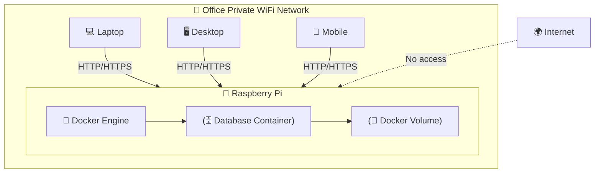

# Data Governance

It is crucial the data in the system stays within the control of Every Cloud, and access is limited to those few individuals who are permitted to conduct analysis.

## Physical Architecture

The system will be running on a small machine (Raspberry Pi) within Docker.

This small machine will live inside the Every Cloud office, physical access restricted to that office.

This machine will be connected to the private office WiFi, which means other machines on that same password protected network will be able to access it directly.

## Web Access

The web interface will only be accessible on the local network. So only those on the private WiFi will be able to reach it.
The web interface will not be accessible from the outside world/internet.

In this context...web access means 'a browser calling upon HTTP port 80 to access a web server running locally'
It does not mean 'accessible from the world wide web' or 'accessible from the internet'.

## Secure Shell (SSH) access

SSH access to the underlying box will be setup for the purposes of maintenance. This means that @JoeSharp will be able to remote terminal into the box.

SSH will be port forwarded from Every Clouds internet router. SSH is distinct from HTTP access, so the web interface will not be accessible remotely.

SSH will be protected by RSA Public/Private Key Cryptography, so only Joe with possession of a key, setup on the box in advance, will be able to remote shell.

SSH will not permit user/password based access, it will be locked down to Key based access only.

## Data Persistence

The application runs inside Docker, therefore the database will live inside a docker volume on the machine itself.
This is just like having a word document or spreadsheet in a folder on a computer.
It will not sync to the cloud in any way. The data will not leave the raspberry pi.

A backup process will be created which will run periodically. This will export the database to a file which will be sent to an external hard drive.

This external hard drive will be colocated with the machine in the office, or remain in the possession of one of the office adminstrators.

The data itself can be uploaded, queried and then deleted from the database. The first version of this system will run entirely on 'importing Excel spreadsheets' so...the spreadsheets will remain the 'authoratitive copy' of the data.

Future versions will allow administrators to key the data directly into the database. This will still be via locally hosted web interface, along the same lines as described above.
